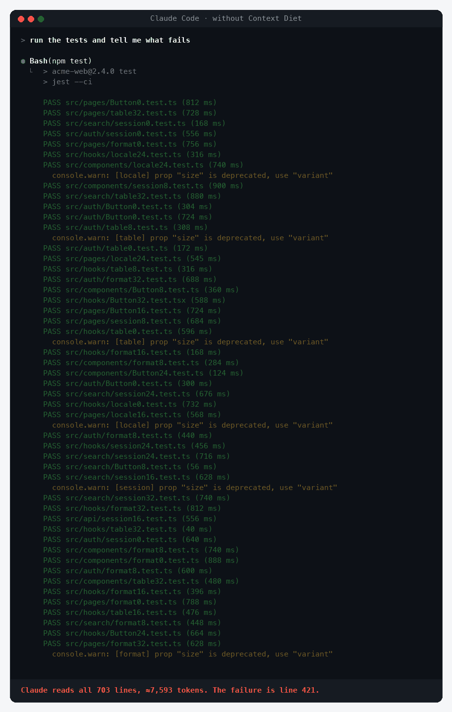
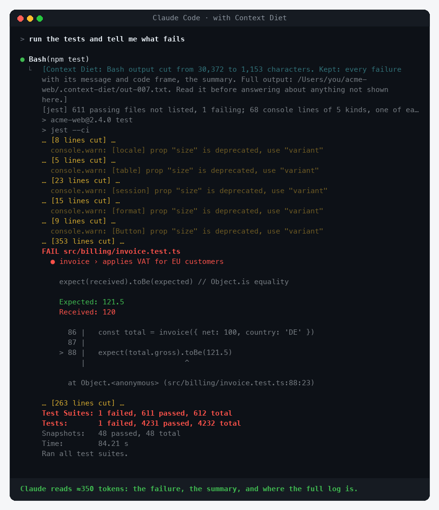
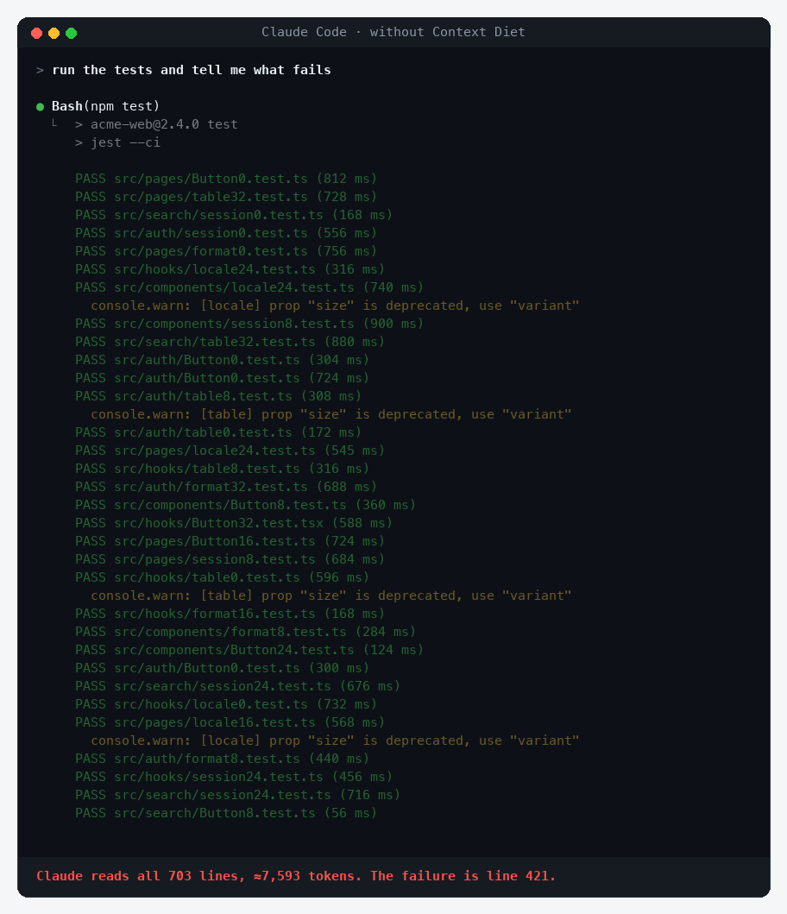
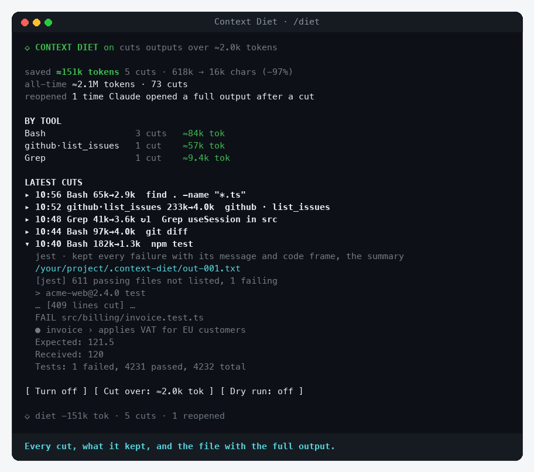

# Context Diet for Claude Code

**Huge tool outputs, trimmed before they fill Claude's context. Nothing is lost: the full text is one Read away.**

Context Diet is a [Claude Code mod](https://code.claude.com/docs/en/plugins/mods/overview). When a command prints a wall of text (a test run, a build log, a 5,000-row JSON, a `git diff` with a lockfile), Claude gets a short digest instead: the errors with their context, the summary, the shape of the data, and the path to a file with the full output. When Claude needs more, it reads that file.

**Works in** the Claude Code terminal and the **Claude desktop app** (Code tab). Tested on macOS.

[](LICENSE)




## Install

In Claude Code:

```
/plugin marketplace add drkokorev/context-diet
/plugin install context-diet@context-diet
```

Or from your shell:

```bash
claude plugin marketplace add drkokorev/context-diet
claude plugin install context-diet@context-diet
```

There is nothing to set up. Run `/diet demo` to see the panel filled in, and `/diet reset` to clear it.

## Why

- **Logs eat the context.** One test run of 600 suites is 30,000 characters, about 7,600 tokens, almost all of them `PASS` lines. A few of those and the context is half full, compaction comes sooner, and Claude forgets what you said at the start.
- **The very long ones hide the failure.** Past about 30,000 characters, Claude Code saves the output to a file and shows Claude only its first 2 KB. A failure in the middle or at the end isn't in that preview, so Claude has to open the file first. Context Diet replaces the preview with a digest of the whole file, so the failure is right there.

## What Claude gets

Every digest starts with a note like this:

```
[Context Diet: Bash output cut from 30,372 to 1,153 characters. Kept: every failure with
its message and code frame, the summary. Full output: /path/to/project/.context-diet/out-007.txt.
Read it before answering about anything not shown here.]
[jest] 611 passing files not listed, 1 failing; 68 console lines of 5 kinds, one of each shown
```

What it keeps depends on what the output is:

| Output | What stays |
| --- | --- |
| **Test runners and build tools it knows**: jest, vitest, `node --test`, pytest, `go test`, cargo, tsc, eslint, npm / yarn / pnpm / pip install, `docker build` | Every failure or error with its message, code frame and stack, the summary; passing tests are counted, not listed; noise (console lines, deprecation warnings, compile steps) shown once per kind with a count |
| **Other logs** | Every error with two lines before and three after, then each distinct warning once, the first and last lines, the summary. Identical lines and lines that differ only in numbers ("Compiling crate_1 … crate_1500") fold into one with a count |
| **Tables, CSV, columns of numbers** | The header and the first and last rows, exactly. Rows are never folded or summarized; the note says which lines were left out |
| **JSON** (Bash or MCP) | The structure: every key, the first items of each array with the count of the rest and their keys, long strings shortened |
| **Diffs** | Every file with its +/− counts and its hunks; lockfiles and generated files (`package-lock.json`, `yarn.lock`, `*.min.js`, `dist/`…) reduced to counts |
| **grep results** | Match counts for every file and the first matches in each, as many as fit |
| **File lists** (`find`, Glob) | Grouped by directory with counts and the first names, the shared path prefix written once |

Outputs from Bash, Grep, Glob and MCP tools (JSON only) longer than 8,000 characters (≈2k tokens) get a digest; shorter ones pass as they are. The threshold is one command away: `/diet 16k`.

## Running the same command again

The usual loop is run the tests, fix, run them again, five or ten times. When a command's output is long both times, Context Diet shows what changed since the last run instead of the whole digest again: the new lines, the lines that are gone, and the end of this run. Timings, sizes and hashes are ignored when comparing. It picks whichever is shorter, the comparison or a fresh digest.

## It checks itself

- **Reopened outputs.** When Claude opens a saved full output after a cut, the digest wasn't enough. The panel counts it, and once a command's outputs keep getting reopened (twice, and at least half its cuts), that command is cut only when twice as long. You get a toast when that happens.
- **Dry run.** `/diet dry` changes nothing: outputs reach Claude whole, and the panel shows what would have been cut and saved. A safe way to try it on your own work first.
- **Kept whole per project.** `/diet keep make deploy` keeps the output of any command containing that text whole, in this project only.
- **Fails safe.** If anything goes wrong (a file can't be saved, an output it can't parse), the output reaches Claude exactly as it came, and `/diet report` shows the last error.

## Does it make Claude's answers worse?

That is the right question. We tested it: seven tasks with a known answer, each given to two fresh Claude agents (Sonnet), one with Context Diet and one without. Each agent ran the same command first and then could use any tool it liked.

| Task | Output | Without | With Context Diet |
| --- | --- | --- | --- |
| Which test failed, where, expected vs received | Jest log, 155k chars, failure in the middle | ✅ 2 steps (had to open the file) | ✅ **1 step** |
| Build error and warning | Webpack log, 18k | ✅ 1 step, 61.2k tokens | ✅ 1 step, **52.5k** |
| A row's values, and the region with most units | CSV, 3,000 rows | ✅ 2 steps | ✅ 2 steps |
| A user's email by id, and the number of admins | JSON, 800 users | ✅ 2 steps | ✅ 2 steps |
| The one call with options among 600 matches | grep, 100k | ✅ 3 steps | ✅ **1 step** |
| What changed in the code, next to a huge lockfile diff | diff, 226k | ✅ 2 steps | ✅ **1 step** |
| Which pytest failed and why | pytest log, 19k | ✅ 1 step, 58.7k tokens | ✅ 1 step, **51.2k** |
| **Total** | | **7 of 7, 13 tool calls** | **7 of 7, 8 tool calls** |

- **Same accuracy.** Both groups answered all seven correctly.
- **Fewer steps.** With the digest, the answer was usually already on screen: 8 tool calls instead of 13.
- **Fewer tokens on mid-size outputs.** On the two logs under 30k characters, each task used 7–9k fewer tokens (about 15%). On the very long ones the saving is small, because Claude Code already trims those; the win there is the missing step.
- **On data, Claude still reads the file.** For the CSV and JSON questions both groups opened the full data, which is what you want: the digest showed the shape and said what was missing, and nobody guessed.

Small print: synthetic fixtures, one run each, one model. It shows the mod does its job without getting in the way, not a benchmark.

### Fixing real bugs, three models

A small Python project with 600 tests and two hidden bugs (3 tests fail). Each agent was asked to run the tests, fix the source without touching the tests, and re-run until everything passes. Two runs per model with Context Diet, two without.

| Model | Without: fixed | With: fixed | Without: tool calls | With: tool calls | Without: tokens | With: tokens |
| --- | --- | --- | --- | --- | --- | --- |
| Haiku | 2 of 2 | 2 of 2 | 9.5 | 7 | 61.5k | **54.6k** |
| Sonnet | 2 of 2 | 2 of 2 | 9 | 6.5 | 59.5k | **56.9k** |
| Opus | 2 of 2 | 2 of 2 | 5.5 | 4.5 | 60.5k | **58.0k** |

- **Every agent fixed both bugs, with and without.** No test file was changed.
- **Fewer steps:** 6 tool calls on average instead of 8.
- **Fewer tokens:** about 7% of the total, which includes some 50k of each agent's fixed instructions; on the task itself, roughly 10k without and 4–5k with, where the mod handled every run.
- 3 of the 12 long test outputs in the Context Diet group reached the agent whole: the development copy of the mod could not save the full output (most likely a stale working directory while it was being reloaded during the run). It now asks for the working directory on every output, passes the output whole if a save fails, and reports why. Two of those three were Opus runs, which is why Opus gained the least.
- A limit of Claude Code itself showed up: when a command fails, Claude Code shortens its output to about 10,000 characters by cutting the middle and end, without saving it, so pytest's failure section never reached either group. Agents in both groups re-ran the tests with `tail` or `grep` to see it. Capturing such outputs before they are shortened is on the roadmap.

## What it leaves alone

- **Read, Edit, Write**: Claude always sees files whole
- **WebFetch** and **MCP answers that aren't JSON** (documentation, prose)
- Anything under the threshold
- A command that reads a saved output (`.context-diet/…`) or carries `# diet:off`, for when you want one output uncut

## The panel

`/diet` opens a panel with the tokens saved this session and all time, how often Claude reopened a full output, the savings per tool, and the latest cuts (Δ marks a comparison with the previous run, ↻ a reopened one). Open a cut to see what it kept, the path to the full output and the start of what Claude read. Under the prompt, the status line reads like `◇ diet −42k tok · 17 cuts · 1 reopened`.

<details>
<summary><b>Screenshots</b></summary>

**What Claude reads with Context Diet**



**What it reads without**



**The panel**



</details>

The pictures are rendered from the mod's real compressor and panel (`media/` has the scripts).

## Commands

| Command | What it does |
| --- | --- |
| `/diet` | Open the panel (or print a report where no panel can be shown) |
| `/diet report` | Print the report in the transcript, with the last error if there was one |
| `/diet on` · `off` | Turn it on or off |
| `/diet dry` | Measure only: nothing is cut, the panel shows what would be saved (`/diet dry off` to cut again) |
| `/diet keep <text>` · `unkeep <text>` | Keep whole, in this project, the output of any command containing the text; `/diet keep` lists them |
| `/diet 16k` | Cut outputs longer than this many characters (default 8000) |
| `/diet demo` · `reset` | Fill the panel with sample cuts, or clear this session's figures |

## Where the full outputs go

Each cut output is saved whole, exactly as it came, to `.context-diet/out-NNN.txt` in your project. The folder carries its own `.gitignore`, so git never sees it. The names cycle through 300 slots, so the folder stops growing at 300 files. When Claude Code has already saved an output to a file, Context Diet uses that file and writes nothing.

## Privacy

Context Diet runs inside your Claude Code process and makes no network requests. It changes only what the model reads, and the full text stays on your disk. It writes nowhere but `.context-diet/` in your project, plus a counter, all-time totals, the `/diet keep` lists and the last error in the plugin's local store.

## Requirements

- Claude Code **v2.1.287 or later** (mods are on by default). Check with `claude --version`.
- The digests work wherever Claude Code loads mods; the panel draws in the terminal and the desktop app's Code tab. The regular chat tab of the desktop app does not load mods.

## Develop

```bash
git clone https://github.com/drkokorev/context-diet
cd context-diet
claude plugin validate plugins/context-diet
claude plugin test plugins/context-diet
claude --plugin-dir plugins/context-diet
```

The compressors are pure functions in `plugins/context-diet/hooks/diet.ts` (logs, JSON, diffs, grep, tables, repeated runs) and `hooks/tools.ts` (one parser per test runner and build tool); the hooks, panel and commands are in `hooks/register.tsx`. The tests include realistic outputs of every tool it knows, hard cases (failures in the first line, `errorHandler.test.ts` that passes, Russian logs, 2 MB single-line JSON), 700 random outputs, and a 4 MB log digested in under half a second. Issues and pull requests are welcome, especially logs it digests badly.

## Roadmap

- Capture the full output of a failing command before Claude Code shortens it
- More tools: gradle and maven, jest's JSON reporter, playwright, terraform plan
- Thresholds per tool in `/config`
- Clearing old saved outputs from the panel
- A shared view with [Cockpit](https://github.com/drkokorev/cockpit-for-claude): see the context hogs there, trim them here

## License

[MIT](LICENSE)
